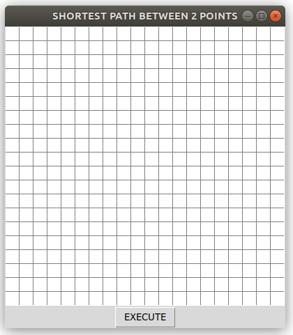
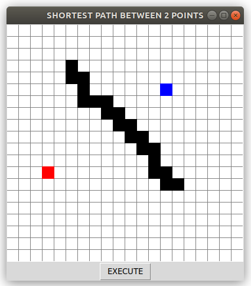
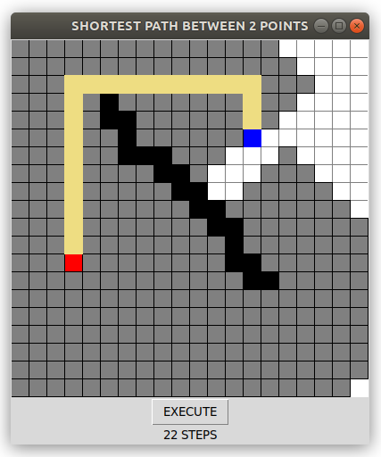

## Practical use of Breath-Search-First Algorithm
This kind of algorithm is used GPS

## How to use code
At first we have to know how to enter values into code to run properly. After starting the program, you have to enter 3 values in this order

#### width of grid
#### height of grid
#### size of pixel

grid appears after entering values

## SAMPLE 
20 (width of grid)                                                
20 (height of grid)                                     
20 (size of pixel)

Then we need to draw our points, by PC mouse
#### Start point = left click
#### End point = right click
#### Erase = middle click
#### Obstacle = holding and moving middle button

Then just push 'EXECUTE' button to run program. When program is done, you can see shortest path between 2 points in the grid + in the bottom is number represented how much steps you need to do from START POINT to END POINT

